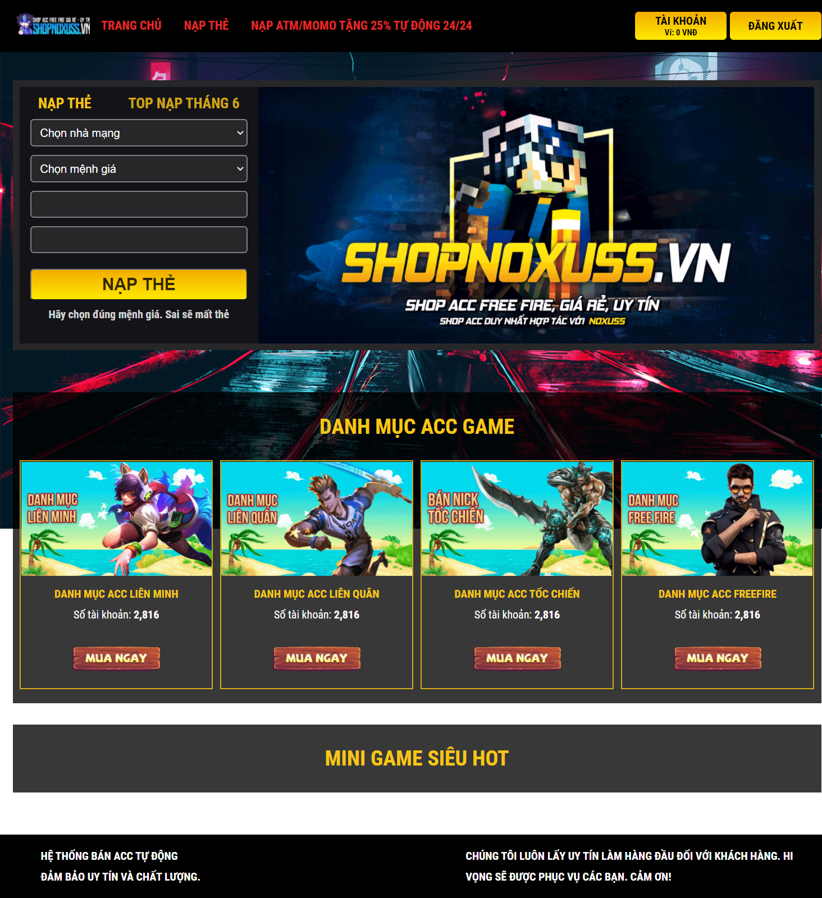
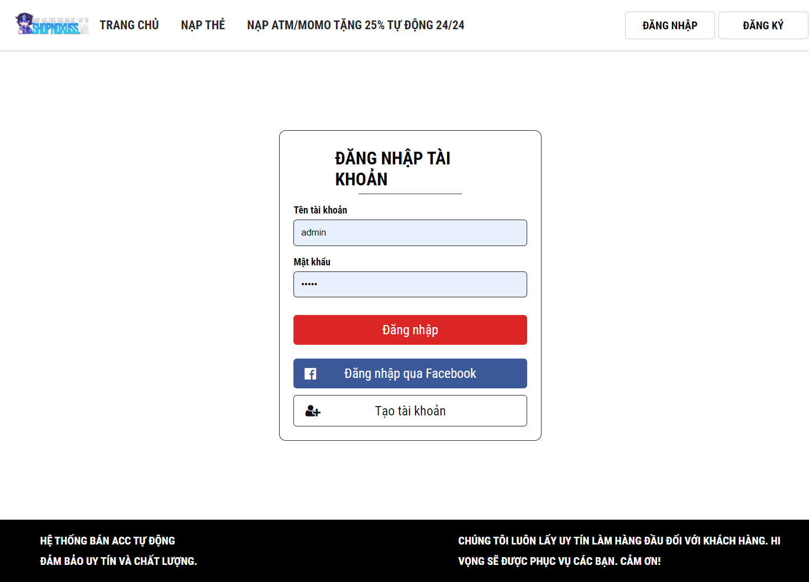
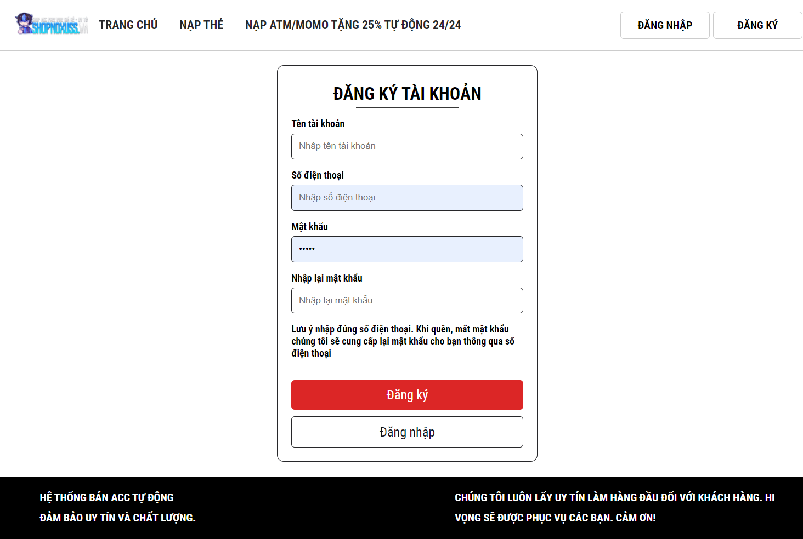

# Website to sell game account

<b>shop account game, web site sell account game, game web</b>

<h2>Home page</h2>

<h2>Login page</h2>

<h2>Register page</h2>

<h2>Detail account page</h2>

<h2>Requirements</h2>
<ul>
  <li><a href="https://nodejs.org/en/">Node.js</a> (with build tools checked)</li>
  <li><a href="https://vuejs.org/">Vuejs</a> (2.x.)</li>
  <li><a href="https://www.mongodb.com/">MongoDB</a></li>
</ul>

<h2>Instructions - Quick</h2>

<b><i>Note: there is guide to run app with linux command line. If use window need install git bash and run command in git bash</i></b>

git clone https://github.com/drdung1999/shop-acc-game.git

<b>Run server</b>

<ol>
  <li>cd shop-acc-game/backend</li>
  <li>npm install</li>
  <li>source env/env.sh</li>
  <li>npm run dev</li>
</ol>

<b>Run frontend</b>

<ol>
  <li>cd shop-acc-game/frontend</li>
  <li>npm install</li>
  <li>npm run serve</li>
</ol>

<b><i>To make sure website run exactly, it require run both frontend and backend.</i></b>

<h2>FAQ</h2>

If have any questions you can <b><a href="https://www.facebook.com/profile1.account.tab.id100009">send it for me</a></b> or <b>Gmail duongdung12a8@gmail.com</b>

 
<h2>Happy codding!</h2>
